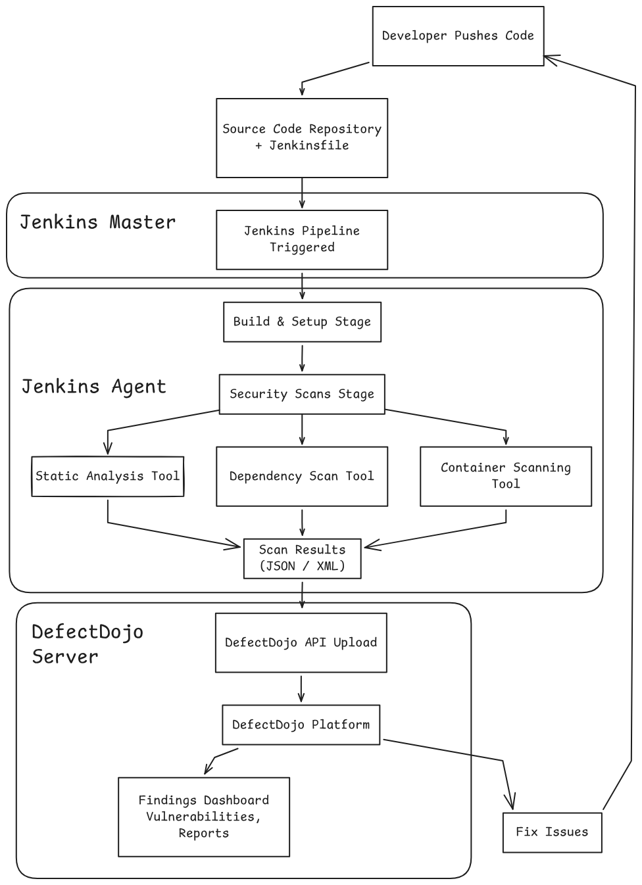

# Modular Jenkins DevSecOps Pipeline

A professional, security-first pipeline framework designed for automated security assurance and centralized vulnerability management. This repository showcases a decoupled DevSecOps architecture that integrates industry-standard security tools into a standard CI/CD workflow, using a Node.js To-Do application as a demonstration target.

## Overview

The primary product of this repository is the **Modular DevSecOps Pipeline**. While currently configured to scan a Node.js demonstration app, the pipeline is architected to be tool-agnostic and portable, allowing it to be adapted for various technology stacks with minimal configuration.

### Key Features
- **Security as Code**: All security checks are defined and versioned within the `Jenkinsfile-v2`.
- **Parallel Execution**: Scans are orchestrated in parallel to minimize pipeline latency.
- **Automated Governance**: A strict Security Gate enforces quality by failing builds on High or Critical vulnerabilities.
- **Centralized Reporting**: Vulnerability findings are normalized and uploaded to **DefectDojo** for unified management.

## Visual Workflow

The pipeline follows a structured path from code commit to security validation.



### Generic Stages:
1. **Environment Preparation**: Setting up report directories and tool caches.
2. **Build**: Packaging the application (e.g., Docker image construction).
3. **Parallel Security Scans**: Concurrent execution of multiple security tools.
4. **Aggregated Reporting**: Consolidating findings and uploading them to a central dashboard.
5. **Governance Gate**: Final evaluation based on the security policy.

## Technology Stack

### Security Pipeline
- **Orchestration**: Jenkins (Declarative Pipeline)
- **Infrastructure**: Docker, Bash
- **Vulnerability Management**: DefectDojo

### Security Toolset
| Category | Tool | Description |
| :--- | :--- | :--- |
| **Linting** | [Hadolint](https://github.com/hadolint/hadolint) | Dockerfile best practices and optimization. |
| **SAST** | [Semgrep](https://semgrep.dev/) | Static analysis for code vulnerabilities and logic flaws. |
| **Secret Detection** | [Gitleaks](https://github.com/gitleaks/gitleaks) | Prevention of hardcoded secrets and credentials. |
| **SCA (FS)** | [Trivy](https://aquasecurity.github.io/trivy/) | Filesystem scan for vulnerable dependencies. |
| **SCA (SBOM)** | [Syft](https://github.com/anchore/syft) & [Grype](https://github.com/anchore/grype) | SBOM generation and vulnerability scanning. |
| **Container Security** | [Trivy](https://aquasecurity.github.io/trivy/) | Image scan for OS-level vulnerabilities. |
| **Code Quality/Security**| [SonarQube](https://www.sonarqube.org/) | Deep code analysis and security hotspots identification. |

### Demonstration Target
- **Platform**: Node.js (Express, EJS)
- **Application**: Simple To-Do List Manager

## How the Pipeline Works

The pipeline utilizes a "Security as Code" approach to ensure consistency across environments. Each tool is configured with specific failure criteria (e.g., `exit-code 1` on High/Critical findings). 

1. **Isolation**: Tools run in isolated steps, and their outputs are captured in a centralized `reports/` directory.
2. **Persistence**: To optimize performance, the pipeline utilizes persistent caches for Trivy and Grype databases.
3. **Normalization**: The `Upload to DefectDojo` stage uses the DefectDojo API to reimport scan results. This ensures that findings are deduplicated: existing issues are updated, and resolved issues are automatically closed in the management console.
4. **The Sentinel Gate**: A sentinel file (`.security_failed`) is used to communicate failures across parallel stages. If any critical scan fails, the "Final Security Gate" halts the pipeline, preventing vulnerable code from progressing further.

## Deployment & Execution

### Running the Demo Application
To run the demonstration To-Do application locally, ensure you have [Docker Compose](https://docs.docker.com/compose/) installed:

```
docker-compose up --build
```
The application will be accessible at `http://localhost:8000`.

### Running the Pipeline
The `Jenkinsfile-v2` is designed for a Jenkins environment with the following requirements:

1. **Jenkins Agent**: A Linux-based agent (labeled `Agent43`) with Docker installed and the `jenkins` user in the `docker group`.
2. **Tool Binaries**: The following tools must be available in the agent's PATH:
   - `docker`, `hadolint`, `semgrep`, `gitleaks`, `trivy`, `syft`, `grype`, `curl`, `python3`, `jq`.
3. **Credentials**:
   - `defect-dojo-10-81-2-34`: A Secret Text credential containing your DefectDojo API Key.
   - `Sonar`: A SonarQube environment configured in Jenkins global tool configuration.
4. **Adaptation**: To use this pipeline for a different project, update the `IMAGE_NAME` and `DD_PRODUCT` variables in `Jenkinsfile-v2`.

---